### Hi there 👋 This is 龚易乾

- 🎓 I am an undergraduate majoring in Communication Engineering at South China Normal University（SCNU，华南师范大学）
- 🔭 I’m currently working for VANGUARD, RoboMaster team of SCNU
- 🦾 I can program in C/C++, Python and Java
- 🌱 I’m currently learning SLAM and RL
- 📫 How to reach me: Email: codealan@qq.com QQ: 2546379375
<!--  -->

<!--  -->

  
  

<!-- <h2 align="center">Reach me on </h2>

 -->

<h2 align="center">Technology Stack </h2>

<!--  -->

<!-- 贪吃蛇 - 图片有 actions/Generate Snake 定时生成 -->
<picture>
  <source media="(prefers-color-scheme: dark)" srcset="./assets/github-snake-dark.svg" />
  <source media="(prefers-color-scheme: light)" srcset="./assets/github-snake.svg" />
  
</picture>

<!--
**CodeAlanqian/CodeAlanqian** is a ✨ _special_ ✨ repository because its `README.md` (this file) appears on your GitHub profile.

Here are some ideas to get you started:

- 🔭 I’m currently working on ...
- 🌱 I’m currently learning ...
- 👯 I’m looking to collaborate on ...
- 🤔 I’m looking for help with ...
- 💬 Ask me about ...
- 📫 How to reach me: ...
- 😄 Pronouns: ...
- ⚡ Fun fact: ...
-->
